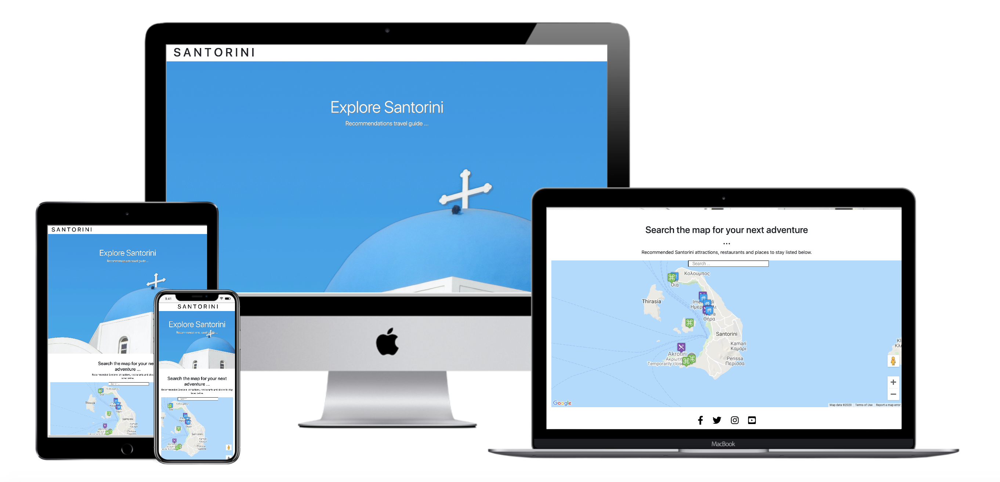

# SANTORINI

**Code Institute - Interactive Frontend Development Milestone Project**

A travel website dedicated to Santorini in Greece, inspired from a recent trip to the islands. Relevant useful information for first time travellers to the island, local attractions, recommended food & drink and places to stay during your visit. Increasing awareness and tourism to the area. Designed to be responsive and accessible on a range of devices, making it easy to navigate for potential users.

## Demo
A live demo can be found [here](https://anronuay.github.io/MS2-Santorini/).

<h2 align="center"></h2>

## User Experience (UX)

1. As a user, I want to easily understand the main purpose of the site and learn more about the individual/organisation.
2. As a user, I want to be able to easily navigate throughout the site to find content.
3. As a user, I want to look for infomation relevant to Santorini that could help aid a propective visitor/traveller to the island. Both in the form of recommodations and other dedicated Santorini travel sites, in the social media links.

    -   ### Design
    -   #### Colour Scheme
        -   The three main colours used are black, white and [Greek flag] blue. Keeping the colour scheme simple, yet effective.
    -   #### Typography
        -   I opted to use the default Bootstrap font Apple System, due to it’s clean font style, which fitted in with the aesthetic I wanted for the website.
    -   #### Imagery
        -   A strong landscape image with bold colours iconic to Santorini and Greece, was used on the landing page, to catch the user’s attention. Strong imagery has been proven to help engage the user.

*   ### Wireframes

    -   Desktop Wireframe  - 	[Page 1](https://github.com/anronuay/MS2-Santorini/blob/master/wireframes/bw-desktop.page1.png)
    				[Page 2](https://github.com/anronuay/MS2-Santorini/blob/master/wireframes/bw-desktop.page2.png)
    
    -   Tablet Wireframe - 	[Page 1](https://github.com/anronuay/MS2-Santorini/blob/master/wireframes/bw-tablet.page1.png)
    				[Page 2](https://github.com/anronuay/MS2-Santorini/blob/master/wireframes/bw-tablet.page2.png)

    -   Mobile Wireframe - 	[View](https://github.com/anronuay/MS2-Santorini/blob/master/wireframes/bw-mobile.page.png)

## Features

-   Responsive on all device sizes

-   Interactive elements

## Technologies Used

### Languages Used

-   [HTML5](https://en.wikipedia.org/wiki/HTML5)
-   [CSS3](https://en.wikipedia.org/wiki/Cascading_Style_Sheets)
-   [JavaScript](https://en.wikipedia.org/wiki/JavaScript)

### Frameworks, Libraries & Programs Used

1. [Bootstrap 4.5.2:](https://getbootstrap.com/docs/4.5/getting-started/introduction/)
    - Bootstrap was used to assist with the responsiveness and styling of the website.
1. [Hover.css v2](https://ianlunn.github.io/Hover/)
    - Hover.css was used on the Social Media icons in the footer to add the float transition while being hovered over.
1. [Font Awesome:](https://fontawesome.com/)
    - Font Awesome was used on the footer of the website to add icons for aesthetic and UX purposes.
1. [jQuery:](https://jquery.com/)
    - jQuery - JavaScript library.
1. [Git](https://git-scm.com/)
    - Git was used for version control by utilising the Gitpod terminal to commit to Git and Push to GitHub.
1. [GitHub:](https://github.com/)
    - GitHub is used to store the projects code after being pushed from Git.
1. [Balsamiq:](https://balsamiq.com/)
    - Balsamiq was used to create the [wireframes](https://github.com/anronuay/MS2-Santorini/tree/master/wireframes) during the design process.
1. [WebAIM:](https://webaim.org/resources/contrastchecker/)
    - Contrast checker, relevant in terms of accessibility and UX design.
1. [PicResize:](https://picresize.com/)
    - Free original picture editing tool on the Internet. Used to help resize all the map info window images.
1. [Map Icons Collection:](https://mapicons.mapsmarker.com/)
    - Free icons for Google Maps or Google Earth. Used as customised markers on my Google map.

## Testing

The W3C Markup Validator and W3C CSS Validator Services were used to validate every page of the project to ensure there were no syntax errors in the project. Along with JS Hint to ensure there were no linting issues with my JavaScript.

-   [W3C Markup Validator](https://validator.w3.org/#validate_by_input) - [Results](https://github.com/anronuay/MS2-Santorini/blob/master/assets/images/w3c-markup.validator.png)
-   [W3C CSS Validator](https://jigsaw.w3.org/css-validator/#validate_by_input) - [Results](https://github.com/anronuay/MS2-Santorini/blob/master/assets/images/w3c-css.validator.png)
-   [JS Hint Version 2.12.0](https://jshint.com/)

### Testing User Stories from User Experience (UX) Section

-   #### First Time Visitor Goals

    1. As a First Time Visitor, I want to easily understand the main purpose of the site and learn more about the individual. - [View]()

        1. Upon entering the site, users are automatically greeted with a clean and easily readable navigation bar to go to the page of their choice. Underneath there is a profile image with a small blurb and a Download CV and Contact, call to action buttons.
        2. The user has two options, click the call to action buttons or scroll down, both of which will lead to the same place, to learn more about the individual.

    2. As a First Time Visitor, I want to be able to easily be able to navigate throughout the site to find content. - [View]()

        1. The site has been designed to be fluid and never to entrap the user. At the top of each page there is a clean navigation bar, each link describes the page they will end up at clearly.
        2. At the bottom of the first 3 pages there is a redirection call to action to ensure the user always has somewhere to go and doesn't feel trapped as they get to the bottom of the page.

    3. As a First Time Visitor, I want to look through their portfolio to understand what their skillset and personality is and if they are competent. I also want to locate their social media links to see their content on social media to determine how trusted and known they are. - [View]()

	    1. Once the new visitor has read the about me and resume, they will notice the contact section.
        2. The user can also scroll to the bottom of any page on the site to locate social media links in the footer.
        3. At the bottom of the contact page, the user is told underneath the form, that alternatively they can contact the individual on social media which highlights the links to them.

### Further Testing

-   The Website was tested on Google Chrome and Safari browsers.
-   The website was viewed on a variety of devices such as Desktop, Laptop, iPhone 5SE & Samsung Galaxy S10.
-   A large amount of testing was done to ensure that all pages were linking correctly.
-   Friends and family members were asked to review the site and documentation to point out any bugs and/or user experience issues.

### Known Bugs

-   On some mobile devices some of the Resume sub headings are slightly out of centre alignment.
-   Some spacing of elements is noticeable due to the responsive nature of the website and the sticky navbar.

## Deployment

### GitHub Pages

The project was deployed to GitHub Pages using the following steps...

1. Log in to GitHub and locate the [GitHub Repository](https://github.com/).
2. At the top of the Repository (not top of page), locate the "Settings" Button on the menu.
3. Scroll down the Settings page until you locate the "GitHub Pages" Section.
4. Under "Source", click the dropdown called "None" and select "Master Branch".
5. The page will automatically refresh.
6. Scroll back down through the page to locate the now published site [link](https://github.com) in the "GitHub Pages" section.

### Forking the GitHub Repository

By forking the GitHub Repository we make a copy of the original repository on our GitHub account to view and/or make changes without affecting the original repository by using the following steps...

1. Log in to GitHub and locate the [GitHub Repository](https://github.com/).
2. At the top of the Repository (not top of page) just above the "Settings" Button on the menu, locate the "Fork" Button.
3. You should now have a copy of the original repository in your GitHub account.

### Making a Local Clone

1. Log in to GitHub and locate the [GitHub Repository](https://github.com/).
2. Under the repository name, click "Clone or download".
3. To clone the repository using HTTPS, under "Clone with HTTPS", copy the link.
4. Open Git Bash
5. Change the current working directory to the location where you want the cloned directory to be made.
6. Type `git clone`, and then paste the URL you copied in Step 3.

```
$ git clone https://github.com/YOUR-USERNAME/YOUR-REPOSITORY
```

7. Press Enter. Your local clone will be created.

```
$ git clone https://github.com/YOUR-USERNAME/YOUR-REPOSITORY
> Cloning into `CI-Clone`...
> remote: Counting objects: 10, done.
> remote: Compressing objects: 100% (8/8), done.
> remove: Total 10 (delta 1), reused 10 (delta 1)
> Unpacking objects: 100% (10/10), done.
```

## Credits

### Code

-   [W3Schools](https://www.w3schools.com/) online web tutorials used throughout, reinforcing my knowledge acquired through the course.
-   [Bootstrap4](https://getbootstrap.com/docs/4.5/getting-started/introduction/): Bootstrap Library used throughout the project mainly to make site responsive using the Bootstrap Grid System.
-   [Google Maps Platform](https://cloud.google.com/maps-platform) Google Map API.
-   [Traversy Media](https://youtu.be/Zxf1mnP5zcw) YouTube Google Maps JavaScript API Tutorial.
-   [Stack Overflow](https://stackoverflow.com/) Public platform is used by nearly everyone who codes, to learn, share their knowledge and collaborate.


### Content

-   All content was written by the developer, unless stated otherwise.

### Media

-   [Unsplash](https://unsplash.com/): The internet’s source of freely-usable images. Powered by creators everywhere.
-   Main landscape image taken by Clark Van Der Beken.

### Acknowledgements

-   Code Institute's Tutor support team, my Mentor and the Slack community.

**This is for educational use.**
